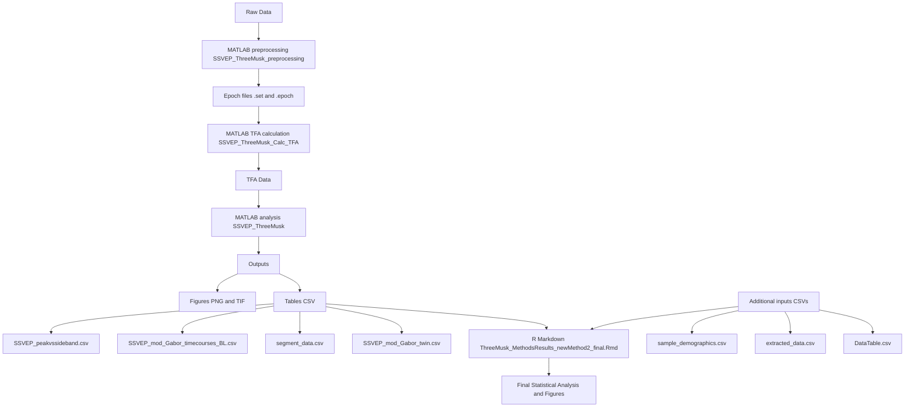

# Interactive Graph Network Demo

This is a demo of a non-hierarchical graph visualization using [vis-network](https://visjs.github.io/vis-network/), hosted on GitHub Pages.

## 🔗 Live Demo

👉 [View the interactive graph](https://yourusername.github.io/graph-network-demo/)

## 📁 Files

- `index.html`: Main page
- `graph.js`: JavaScript for loading and rendering the graph
- `data.json`: Graph data (nodes + edges)

